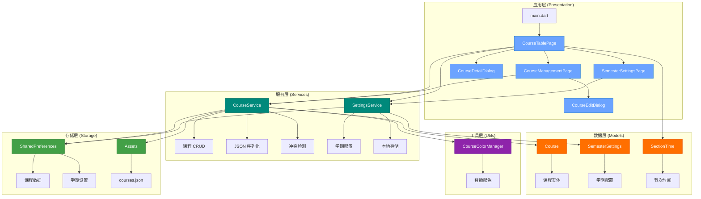

# CLAUDE.md

This file provides guidance to Claude Code (claude.ai/code) when working with code in this repository.

## 项目概述

**课程表应用 (Curriculum)** - 一个基于 Flutter 开发的跨平台智能课程管理应用,支持 Android 和 Web 平台。

**核心功能:**
- 📅 可视化周历课程表展示
- 🔄 灵活的学期设置与周次管理
- ✏️ 完整的课程 CRUD 操作
- 🎨 智能颜色分配与高辨识度设计
- 💾 本地数据持久化存储
- 🌐 多语言支持 (中文/英文)

**技术标识:**
- **包名**: com.lparksi.curriculum
- **支持平台**: Android, Web
- **Flutter 版本**: 3.35.6
- **Dart 版本**: 3.9.2
- **版本**: 1.0.0+1

---

## 整体架构

### 架构图



### 分层架构说明

**1. 应用层 (lib/pages/ + lib/widgets/)**
- 职责:用户交互、UI 渲染、路由导航
- 模式:StatefulWidget + setState 状态管理
- 导航:使用 Navigator 进行页面跳转

**2. 服务层 (lib/services/)**
- 职责:业务逻辑、数据处理、外部交互
- 特点:静态方法设计,支持异步操作
- 依赖:SharedPreferences、Flutter assets

**3. 数据层 (lib/models/)**
- 职责:数据实体定义、序列化/反序列化
- 特点:不可变模型、工厂构造函数
- 序列化:支持 JSON 双向转换

**4. 工具层 (lib/utils/)**
- 职责:通用工具、算法、常量
- 特点:无状态、纯函数设计

**5. 存储层**
- **SharedPreferences**: 键值对存储 (课程数据、学期设置)
- **Assets**: 只读资源 (默认课程模板)

---

## 模块索引

### 📂 核心模块

| 模块路径 | 职责描述 | 关键文件 | 详细文档 |
|---------|---------|---------|---------|
| [lib/models/](lib/models/) | 数据模型定义 | course.dart<br>semester_settings.dart | [📄 lib/models/CLAUDE.md](lib/models/CLAUDE.md) |
| [lib/services/](lib/services/) | 业务逻辑服务 | course_service.dart<br>settings_service.dart | [📄 lib/services/CLAUDE.md](lib/services/CLAUDE.md) |
| [lib/pages/](lib/pages/) | 页面组件 | course_table_page.dart<br>course_management_page.dart<br>semester_settings_page.dart | [📄 lib/pages/CLAUDE.md](lib/pages/CLAUDE.md) |
| [lib/widgets/](lib/widgets/) | 可复用组件 | course_detail_dialog.dart<br>course_edit_dialog.dart | [📄 lib/widgets/CLAUDE.md](lib/widgets/CLAUDE.md) |
| [lib/utils/](lib/utils/) | 工具函数 | course_colors.dart | [📄 lib/utils/CLAUDE.md](lib/utils/CLAUDE.md) |

### 🔗 模块依赖关系

```
pages/ ──→ services/ ──→ models/
  │           │
  └─→ widgets/│
      │       └─→ utils/
      └─→ models/
```

**依赖原则:**
- 单向依赖:上层依赖下层,下层不依赖上层
- models/ 无外部依赖 (除 Flutter 基础库)
- services/ 仅依赖 models/ 和第三方库
- pages/widgets/ 可依赖所有下层模块

---

## 技术栈

### 核心依赖

| 依赖包 | 版本 | 用途 | 文档 |
|-------|------|------|------|
| **flutter** | SDK | Flutter 框架 | [官方文档](https://docs.flutter.dev/) |
| **flutter_localizations** | SDK | 国际化支持 | [Internationalization](https://docs.flutter.dev/ui/accessibility-and-internationalization/internationalization) |
| **cupertino_icons** | ^1.0.8 | iOS 风格图标 | [pub.dev](https://pub.dev/packages/cupertino_icons) |
| **shared_preferences** | ^2.3.3 | 键值对持久化 | [pub.dev](https://pub.dev/packages/shared_preferences) |

### 开发工具

| 依赖包 | 版本 | 用途 |
|-------|------|------|
| **flutter_test** | SDK | Widget 测试 |
| **flutter_lints** | ^5.0.0 | 代码规范检查 |

### 国际化配置
- **默认语言**: 中文简体 (zh_CN)
- **支持语言**: 中文简体、英文 (en_US)
- **本地化代理**: GlobalMaterialLocalizations, GlobalWidgetsLocalizations, GlobalCupertinoLocalizations

### 主题配置
- **设计语言**: Material Design 3
- **主题色**: `Color(0xFF6BA3FF)` (蓝色系)
- **配置位置**: [lib/main.dart:36-41](lib/main.dart#L36-L41)

---

## 开发命令

### 🚀 运行与调试

```bash
# 运行在 Android 设备/模拟器
flutter run -d android

# 运行在 Web 浏览器
flutter run -d chrome

# 查看可用设备
flutter devices

# 启用详细日志
flutter run -v

# 热重载 (运行时): 按 'r'
# 热重启 (运行时): 按 'R'
# 退出 (运行时): 按 'q'
```

### 🏗️ 构建

```bash
# 构建 Android APK (debug)
flutter build apk

# 构建 Android APK (release)
flutter build apk --release

# 构建 Android App Bundle (用于 Google Play)
flutter build appbundle

# 构建 Web 应用
flutter build web
```

### 🧪 测试与代码质量

```bash
# 运行所有测试
flutter test

# 运行单个测试文件
flutter test test/widget_test.dart

# 代码覆盖率报告
flutter test --coverage

# 运行代码分析
flutter analyze

# 格式化代码
dart format .

# 检查代码格式 (不修改文件)
dart format --output=none --set-exit-if-changed .
```

### 📦 依赖管理

```bash
# 安装依赖
flutter pub get

# 更新依赖
flutter pub upgrade

# 查看过期的依赖
flutter pub outdated

# 清理构建缓存
flutter clean

# 清理并重新安装依赖
flutter clean && flutter pub get
```

### 🛠️ 调试技巧

```bash
# 启用 Widget 调试边框 (运行时按 'p')
# 启用性能叠加层 (运行时按 'P')

# 使用 DevTools
flutter pub global activate devtools
flutter pub global run devtools

# 查看 Widget 树
flutter run --observatory-port=8888
```

---

## 全局开发规范

### 代码风格

**命名约定:**
- Widget 类名:大驼峰 (PascalCase) - 例:`CourseTablePage`
- 变量/方法:小驼峰 (camelCase) - 例:`loadCourses`
- 私有成员:下划线前缀 - 例:`_currentWeek`
- 常量:大驼峰或大写下划线 - 例:`SectionTimeTable.sections` 或 `_COURSES_KEY`

**Widget 组织:**
- 优先使用 `const` 构造函数 (性能优化)
- StatelessWidget 用于不可变 UI
- StatefulWidget 用于需要维护状态的 UI
- 私有方法用 `_buildXxx()` 命名模式构建子组件

**示例:**
```dart
// ✅ 正确
class CourseCard extends StatelessWidget {
  const CourseCard({super.key, required this.course});
  final Course course;

  @override
  Widget build(BuildContext context) {
    return _buildCardContent();
  }

  Widget _buildCardContent() { ... }
}

// ❌ 错误 (缺少 const)
class CourseCard extends StatelessWidget {
  CourseCard({super.key, required this.course});
  final Course course;
  ...
}
```

### 状态管理

**当前方案:**
- 使用 Flutter 内置的 `StatefulWidget` + `setState()`
- 适用于当前应用复杂度

**状态管理最佳实践:**
```dart
// ✅ 正确:在 setState 中仅更新必要的状态
setState(() {
  _courses = newCourses;
});

// ❌ 错误:在 setState 外执行耗时操作
setState(() {
  final courses = await CourseService.loadCourses(); // 异步操作不应在这里
  _courses = courses;
});

// ✅ 正确:异步操作在外,setState 仅更新状态
final courses = await CourseService.loadCourses();
setState(() {
  _courses = courses;
});
```

**未来扩展建议:**
- 当应用复杂度增加时,考虑引入:
  - **Provider**: 轻量级状态管理
  - **Riverpod**: Provider 的改进版
  - **Bloc**: 适合复杂业务逻辑

### 数据持久化规范

**SharedPreferences 使用规范:**
```dart
// ✅ 正确:使用常量定义 key
class CourseService {
  static const String _coursesKey = 'saved_courses';

  static Future<void> saveCourses(List<Course> courses) async {
    final prefs = await SharedPreferences.getInstance();
    await prefs.setString(_coursesKey, jsonEncode(...));
  }
}

// ❌ 错误:硬编码 key
await prefs.setString('courses', data); // key 应该是常量
```

**存储键规范:**
- `saved_courses`: 课程数据 (JSON 字符串)
- `semester_settings`: 学期设置 (JSON 字符串)

### JSON 序列化规范

**模型类必须实现:**
1. `fromJson` 工厂构造函数
2. `toJson` 方法
3. 提供合理的默认值

**示例:**
```dart
class Course {
  final String name;
  final String location;

  Course({required this.name, required this.location});

  // ✅ 正确:提供默认值,处理 null 情况
  factory Course.fromJson(Map<String, dynamic> json) {
    return Course(
      name: json['name'] as String,
      location: json['location'] as String? ?? '', // 默认空字符串
    );
  }

  Map<String, dynamic> toJson() {
    return {
      'name': name,
      'location': location,
    };
  }
}
```

### 错误处理规范

**服务层错误处理:**
```dart
// ✅ 正确:捕获异常并提供降级方案
static Future<List<Course>> loadCourses() async {
  try {
    final jsonString = await rootBundle.loadString('assets/courses.json');
    return parseJson(jsonString);
  } catch (e) {
    debugPrint('加载课程数据失败: $e');
    return []; // 返回空列表作为降级方案
  }
}

// ❌ 错误:不处理异常
static Future<List<Course>> loadCourses() async {
  final jsonString = await rootBundle.loadString('assets/courses.json');
  return parseJson(jsonString); // 异常会向上传播
}
```

### 性能优化规范

**1. 使用 `const` 构造函数:**
```dart
// ✅ 正确
const Text('标题', style: TextStyle(fontSize: 16))

// ❌ 错误
Text('标题', style: TextStyle(fontSize: 16))
```

**2. 避免在 build 方法中创建对象:**
```dart
// ✅ 正确:在类级别定义常量
class MyWidget extends StatelessWidget {
  static const _textStyle = TextStyle(fontSize: 16);

  @override
  Widget build(BuildContext context) {
    return Text('标题', style: _textStyle);
  }
}

// ❌ 错误:每次 build 都创建新对象
Widget build(BuildContext context) {
  return Text('标题', style: TextStyle(fontSize: 16));
}
```

**3. 使用 ListView.builder 而非 ListView:**
```dart
// ✅ 正确:懒加载
ListView.builder(
  itemCount: items.length,
  itemBuilder: (context, index) => ItemWidget(items[index]),
)

// ❌ 错误:一次性创建所有 Widget
ListView(
  children: items.map((item) => ItemWidget(item)).toList(),
)
```

### 平台特定注意事项

**Android:**
- 包名: `com.lparksi.curriculum`
- 配置文件: `android/app/src/main/AndroidManifest.xml`
- 构建配置: `android/app/build.gradle`
- 应用名称修改位置: `AndroidManifest.xml` 中的 `android:label`

**Web:**
- 入口文件: `web/index.html`
- 资源目录: `web/`
- 注意:SharedPreferences 在 Web 上使用 localStorage 实现

---

## 资源文件

### Assets 资源

**courses.json** (`assets/courses.json`)
- 默认课程数据模板
- 包含 19 门示例课程
- 首次启动时加载并保存到本地存储

**JSON 格式示例:**
```json
{
  "courses": [
    {
      "name": "大学体育(三)",
      "location": "篮球场(文明)",
      "teacher": "王银晖",
      "weekday": 1,
      "startSection": 1,
      "duration": 2,
      "startWeek": 1,
      "endWeek": 16,
      "color": ""
    }
  ]
}
```

**字段说明:**
- `weekday`: 1-7 (周一至周日)
- `startSection`: 1-10 (节次)
- `duration`: 持续节数
- `startWeek`/`endWeek`: 周次范围
- `color`: 十六进制颜色 (空字符串则自动分配)

---

## 关键业务逻辑

### 周次计算算法
```dart
// 位置: lib/pages/course_table_page.dart:94-99
int _calculateWeekNumber(DateTime date) {
  final difference = date.difference(_semesterStartDate).inDays;
  final week = (difference / 7).floor() + 1;
  return week.clamp(1, _totalWeeks);
}
```

### 课程时间冲突检测
```dart
// 位置: lib/services/course_service.dart:135-165
static bool hasTimeConflict(
  List<Course> courses,
  Course newCourse, {
  int? excludeIndex,
}) {
  // 检查:同一天 + 周次重叠 + 节次重叠
}
```

### 智能颜色分配算法
```dart
// 位置: lib/utils/course_colors.dart:38-49
static Color getColorForCourse(String courseName) {
  // 同名课程返回相同颜色
  // 使用预优化的 18 色高辨识度色盘
  // 顺序分配,确保最大视觉差异
}
```

---

## 变更记录

**最近更新:** 2025-10-16 11:26:24

### v1.0.0 (2025-10-16)
- ✅ 实现完整的课程管理功能 (CRUD)
- ✅ 实现可配置的学期设置功能
- ✅ 优化周数切换按钮布局稳定性
- ✅ 增大顶部功能按钮尺寸
- ✅ 优化课程颜色辨识度 (18 色高对比度色盘)

### 架构演进
- 从单 `main.dart` 演进为分层架构
- 引入服务层分离业务逻辑
- 实现本地存储优先的数据加载策略

---

## 快速上手

### 首次运行
```bash
# 1. 安装依赖
flutter pub get

# 2. 运行应用
flutter run -d chrome  # Web 端
flutter run -d android # Android 端

# 3. 查看测试
flutter test
```

### 添加新功能
1. 数据模型 → `lib/models/`
2. 业务逻辑 → `lib/services/`
3. UI 组件 → `lib/pages/` 或 `lib/widgets/`
4. 工具函数 → `lib/utils/`

### 调试技巧
- 使用 `debugPrint()` 而非 `print()`
- 善用 Flutter DevTools 查看 Widget 树
- 运行时按 `p` 查看布局边界
- 运行时按 `P` 查看性能叠加层

---

**文档维护:** 此文档随代码库更新,如有疑问请查阅模块级 CLAUDE.md 或源代码注释。
