# CLAUDE.md

This file provides guidance to Claude Code (claude.ai/code) when working with code in this repository.

## 变更记录 (Changelog)

### 最近更新: 2025-10-17 15:06:44

**v1.0.0+1 (2025-10-17) - AI 上下文文档初始化**
- 完成项目 AI 上下文文档体系建设
  - 更新根级 CLAUDE.md，新增多学期支持、WebDAV备份、Firebase集成等功能说明
  - 已存在完整的模块级文档（lib/models/、lib/services/、lib/pages/、lib/widgets/、lib/utils/）
  - 生成 `.claude/index.json` 元数据索引
  - 扫描覆盖率：核心模块 100%，总文件覆盖 37+ 个 Dart 源文件
- 新增核心功能文档化
  - 多学期管理系统（SemesterSettings 增强版）
  - WebDAV 云端备份/恢复功能
  - 数据导入/导出服务（带版本管理）
  - Firebase Crashlytics & Performance Monitoring
  - 应用主题模式切换（亮/暗/系统）
  - 课程隐藏与冲突处理增强

**v1.0.0+1 (2025-10-16)**
- 实现自定义时间表完整功能
  - 新增 `TimeTable` 和 `SectionTime` 数据模型
  - 新增 `TimeTableService` 服务层
  - 新增 `TimeTableManagementPage` 页面
  - 新增 `TimeTableEditDialog` 组件
  - 支持创建、编辑、删除、复制时间表
  - 支持多时间表切换
  - Course 模型更新为使用 TimeTable
- 优化课程表页面加载性能（并行加载数据）
- 废弃 `SectionTimeTable` 常量类

---

## 项目概述

**课程表应用 (Curriculum)** - 一个基于 Flutter 开发的跨平台智能课程管理应用,支持 Android 和 Web 平台。

**核心功能:**
- 📅 可视化周历课程表展示
- 🔄 多学期管理与自动切换
- ✏️ 完整的课程 CRUD 操作
- 🎨 智能颜色分配与高辨识度设计
- ⏰ 自定义时间表管理
- 💾 本地数据持久化存储 + WebDAV 云端备份
- 🌐 多语言支持 (中文/英文)
- 🌓 亮色/暗色主题切换
- 📊 Firebase 性能监控与崩溃报告
- 📤 数据导入/导出（支持版本管理）

**技术标识:**
- **包名**: com.lparksi.curriculum
- **支持平台**: Android, Web
- **Flutter 版本**: 3.35.6 (SDK ^3.9.2)
- **Dart 版本**: 3.9.2
- **版本**: 1.0.0+1

---

## 整体架构

### 模块结构图 (Mermaid)

```mermaid
graph TD
    Root["(根) Curriculum 课程表应用"]

    Root --> Models["lib/models/ - 数据模型层"]
    Root --> Services["lib/services/ - 服务层"]
    Root --> Pages["lib/pages/ - 页面层"]
    Root --> Widgets["lib/widgets/ - 组件层"]
    Root --> Utils["lib/utils/ - 工具层"]
    Root --> Assets["assets/ - 资源文件"]

    Models --> ModelCourse["course.dart<br/>课程实体（含学期ID、隐藏标记）"]
    Models --> ModelSemester["semester_settings.dart<br/>多学期管理"]
    Models --> ModelTimeTable["time_table.dart<br/>自定义时间表"]
    Models --> ModelWebDav["webdav_config.dart<br/>WebDAV配置"]

    Services --> ServiceCourse["course_service.dart<br/>课程CRUD+冲突检测"]
    Services --> ServiceSettings["settings_service.dart<br/>多学期存储+迁移"]
    Services --> ServiceTimeTable["time_table_service.dart<br/>时间表管理"]
    Services --> ServiceExport["export_service.dart<br/>数据导入导出+版本管理"]
    Services --> ServiceWebDav["webdav_service.dart<br/>云端备份/恢复"]
    Services --> ServiceTheme["app_theme_service.dart<br/>主题模式持久化"]
    Services --> ServiceShare["share_service.dart<br/>分享功能（平台抽象）"]

    Pages --> PageTable["course_table_page.dart<br/>主课程表页面"]
    Pages --> PageManage["course_management_page.dart<br/>课程管理"]
    Pages --> PageSemester["semester_management_page.dart<br/>学期管理"]
    Pages --> PageTimeTable["time_table_management_page.dart<br/>时间表管理"]
    Pages --> PageData["data_management_page.dart<br/>数据导入导出"]
    Pages --> PageWebDav["webdav_backup_page.dart<br/>WebDAV备份"]

    Widgets --> WidgetDetail["course_detail_dialog.dart<br/>课程详情"]
    Widgets --> WidgetEdit["course_edit_dialog.dart<br/>课程编辑+冲突提示"]
    Widgets --> WidgetTimeTableEdit["time_table_edit_dialog.dart<br/>时间表编辑"]
    Widgets --> WidgetSemesterEdit["semester_edit_dialog.dart<br/>学期编辑"]
    Widgets --> WidgetShareDialog["course_table_share_dialog.dart<br/>课程表分享"]

    Utils --> UtilColors["course_colors.dart<br/>18色智能配色"]
    Utils --> UtilPerformance["performance_tracker.dart<br/>Firebase性能跟踪"]
    Utils --> UtilIconLoader["material_icon_loader.dart<br/>Material图标加载"]
    Utils --> UtilWebFile["web_file_utils.dart<br/>Web文件操作"]

    Assets --> AssetCourses["courses.json<br/>默认课程数据（19门示例）"]
    Assets --> AssetFonts["fonts/MaterialIcons-Regular.otf<br/>Material图标字体"]

    click Models "/home/parski/projects/curriculum/curriculum/lib/models/CLAUDE.md" "查看数据模型层文档"
    click Services "/home/parski/projects/curriculum/curriculum/lib/services/CLAUDE.md" "查看服务层文档"
    click Pages "/home/parski/projects/curriculum/curriculum/lib/pages/CLAUDE.md" "查看页面层文档"
    click Widgets "/home/parski/projects/curriculum/curriculum/lib/widgets/CLAUDE.md" "查看组件层文档"
    click Utils "/home/parski/projects/curriculum/curriculum/lib/utils/CLAUDE.md" "查看工具层文档"

    classDef modelStyle fill:#FF6F00,stroke:#E65100,color:#fff
    classDef serviceStyle fill:#00897B,stroke:#00695C,color:#fff
    classDef pageStyle fill:#6BA3FF,stroke:#1976D2,color:#fff
    classDef widgetStyle fill:#8E24AA,stroke:#6A1B9A,color:#fff
    classDef utilStyle fill:#43A047,stroke:#2E7D32,color:#fff
    classDef assetStyle fill:#757575,stroke:#424242,color:#fff

    class Models,ModelCourse,ModelSemester,ModelTimeTable,ModelWebDav modelStyle
    class Services,ServiceCourse,ServiceSettings,ServiceTimeTable,ServiceExport,ServiceWebDav,ServiceTheme,ServiceShare serviceStyle
    class Pages,PageTable,PageManage,PageSemester,PageTimeTable,PageData,PageWebDav pageStyle
    class Widgets,WidgetDetail,WidgetEdit,WidgetTimeTableEdit,WidgetSemesterEdit,WidgetShareDialog widgetStyle
    class Utils,UtilColors,UtilPerformance,UtilIconLoader,UtilWebFile utilStyle
    class Assets,AssetCourses,AssetFonts assetStyle
```



### 架构图 (分层视图)

```mermaid
graph TB
    subgraph "应用层 (Presentation)"
        A[main.dart<br/>Firebase初始化+主题管理] --> B[CourseTablePage]
        B --> C[CourseManagementPage]
        B --> D[SemesterManagementPage]
        B --> D2[TimeTableManagementPage]
        B --> D3[DataManagementPage]
        B --> D4[WebDavBackupPage]
        C --> E1[CourseEditDialog]
        D --> E2[SemesterEditDialog]
        D2 --> E3[TimeTableEditDialog]
        B --> E4[CourseDetailDialog]
        B --> E5[CourseTableShareDialog]
    end

    subgraph "服务层 (Services)"
        F[CourseService] --> F1[课程 CRUD]
        F --> F2[JSON 序列化]
        F --> F3[冲突检测+冲突课程列表]
        F --> F4[按学期筛选]
        G[SettingsService] --> G1[多学期管理]
        G --> G2[激活学期切换]
        G --> G3[学期复制/删除]
        G --> G4[旧数据迁移]
        H[TimeTableService] --> H1[时间表 CRUD]
        H --> H2[时间表切换]
        H --> H3[时间格式验证]
        I[ExportService] --> I1[全量导出]
        I --> I2[选择性导出]
        I --> I3[导入+版本管理]
        J[WebDavService] --> J1[云端备份]
        J --> J2[备份恢复]
        J --> J3[文件列表管理]
        K[AppThemeService] --> K1[主题持久化]
        L[ShareService] --> L1[平台抽象]
        L --> L2[Mobile/Web实现]
    end

    subgraph "数据层 (Models)"
        M1[Course] --> M1A[学期ID关联]
        M1 --> M1B[隐藏标记]
        M2[SemesterSettings] --> M2A[多学期支持]
        M2 --> M2B[日期范围计算]
        M3[TimeTable] --> M3A[节次配置]
        M3 --> M3B[时间表验证]
        M4[WebDavConfig] --> M4A[服务器配置]
        M4 --> M4B[备份路径]
    end

    subgraph "工具层 (Utils)"
        N1[CourseColorManager] --> N1A[18色色盘]
        N1 --> N1B[同名课程一致性]
        N2[PerformanceTracker] --> N2A[Firebase集成]
        N2 --> N2B[自定义跟踪]
        N3[MaterialIconLoader] --> N3A[字体加载]
        N4[WebFileUtils] --> N4A[Web文件下载]
    end

    subgraph "存储层 (Storage)"
        O[SharedPreferences] --> O1[saved_courses]
        O --> O2[semesters_list+active_semester_id]
        O --> O3[time_tables+active_time_table_id]
        O --> O4[app_theme_mode]
        O --> O5[webdav_config]
        P[Assets] --> P1[courses.json]
        P --> P2[MaterialIcons-Regular.otf]
        Q[WebDAV] --> Q1[远程备份文件]
    end

    B --> F
    B --> G
    B --> H
    B --> K
    C --> F
    D --> G
    D2 --> H
    D3 --> I
    D4 --> J
    F --> M1
    G --> M2
    H --> M3
    J --> M4
    I --> F
    I --> G
    I --> H
    F --> N1
    B --> N2
    F --> O
    G --> O
    H --> O
    K --> O
    J --> O
    F --> P
    J --> Q

    classDef page fill:#6BA3FF,stroke:#1976D2,color:#fff
    classDef service fill:#00897B,stroke:#00695C,color:#fff
    classDef model fill:#FF6F00,stroke:#E65100,color:#fff
    classDef util fill:#8E24AA,stroke:#6A1B9A,color:#fff
    classDef storage fill:#43A047,stroke:#2E7D32,color:#fff

    class A,B,C,D,E1,E2,E3,E4,E5,D2,D3,D4 page
    class F,G,H,I,J,K,L service
    class M1,M2,M3,M4 model
    class N1,N2,N3,N4 util
    class O,P,Q storage
```



### 分层架构说明

**1. 应用层 (lib/pages/ + lib/widgets/)**
- 职责:用户交互、UI 渲染、路由导航
- 模式:StatefulWidget + setState 状态管理
- 导航:使用 Navigator 进行页面跳转
- 新增:主题切换、学期/时间表管理、数据导入导出、WebDAV 备份

**2. 服务层 (lib/services/)**
- 职责:业务逻辑、数据处理、外部交互
- 特点:静态方法设计,支持异步操作
- 依赖:SharedPreferences、Flutter assets、WebDAV、Firebase
- 新增:多学期管理、版本化导入导出、云端备份、性能跟踪

**3. 数据层 (lib/models/)**
- 职责:数据实体定义、序列化/反序列化
- 特点:不可变模型、工厂构造函数
- 序列化:支持 JSON 双向转换
- 新增:学期ID关联、隐藏标记、WebDAV配置

**4. 工具层 (lib/utils/)**
- 职责:通用工具、算法、常量
- 特点:无状态、纯函数设计
- 新增:Firebase 性能跟踪、Web 文件操作

**5. 存储层**
- **SharedPreferences**: 键值对存储 (课程、学期、时间表、主题、WebDAV配置)
- **Assets**: 只读资源 (默认课程模板、Material 图标字体)
- **WebDAV**: 云端备份存储

---

## 模块索引

### 📂 核心模块

| 模块路径 | 职责描述 | 关键文件 | 详细文档 |
|---------|---------|---------|---------|
| [lib/models/](lib/models/) | 数据模型定义 | course.dart (含学期ID、隐藏标记)<br>semester_settings.dart (多学期)<br>time_table.dart<br>webdav_config.dart | [📄 lib/models/CLAUDE.md](lib/models/CLAUDE.md) |
| [lib/services/](lib/services/) | 业务逻辑服务 | course_service.dart (学期筛选)<br>settings_service.dart (多学期+迁移)<br>time_table_service.dart<br>export_service.dart (版本管理)<br>webdav_service.dart<br>app_theme_service.dart<br>share_service.dart | [📄 lib/services/CLAUDE.md](lib/services/CLAUDE.md) |
| [lib/pages/](lib/pages/) | 页面组件 | course_table_page.dart<br>course_management_page.dart<br>semester_management_page.dart<br>time_table_management_page.dart<br>data_management_page.dart<br>webdav_backup_page.dart | [📄 lib/pages/CLAUDE.md](lib/pages/CLAUDE.md) |
| [lib/widgets/](lib/widgets/) | 可复用组件 | course_detail_dialog.dart<br>course_edit_dialog.dart (冲突提示)<br>time_table_edit_dialog.dart<br>semester_edit_dialog.dart<br>course_table_share_dialog.dart | [📄 lib/widgets/CLAUDE.md](lib/widgets/CLAUDE.md) |
| [lib/utils/](lib/utils/) | 工具函数 | course_colors.dart (18色色盘)<br>performance_tracker.dart (Firebase)<br>material_icon_loader.dart<br>web_file_utils.dart | [📄 lib/utils/CLAUDE.md](lib/utils/CLAUDE.md) |

### 🔗 模块依赖关系

```
pages/ ──→ services/ ──→ models/
  │           │            ↑
  │           └─→ utils/   │
  └─→ widgets/ ────────────┘
```

**依赖原则:**
- 单向依赖:上层依赖下层,下层不依赖上层
- models/ 无外部依赖 (除 Flutter 基础库)
- services/ 仅依赖 models/、utils/ 和第三方库
- pages/widgets/ 可依赖所有下层模块

---

## 技术栈

### 核心依赖

| 依赖包 | 版本 | 用途 | 文档 |
|-------|------|------|------|
| **flutter** | SDK | Flutter 框架 | [官方文档](https://docs.flutter.dev/) |
| **flutter_localizations** | SDK | 国际化支持 | [Internationalization](https://docs.flutter.dev/ui/accessibility-and-internationalization/internationalization) |
| **cupertino_icons** | ^1.0.8 | iOS 风格图标 | [pub.dev](https://pub.dev/packages/cupertino_icons) |
| **shared_preferences** | ^2.3.3 | 键值对持久化 | [pub.dev](https://pub.dev/packages/shared_preferences) |
| **file_picker** | ^10.3.3 | 文件选择器 | [pub.dev](https://pub.dev/packages/file_picker) |
| **path_provider** | ^2.1.5 | 路径获取 | [pub.dev](https://pub.dev/packages/path_provider) |
| **share_plus** | ^12.0.0 | 分享功能 | [pub.dev](https://pub.dev/packages/share_plus) |
| **webdav_client** | ^1.2.2 | WebDAV 客户端 | [pub.dev](https://pub.dev/packages/webdav_client) |
| **firebase_core** | ^3.12.0 | Firebase 核心 | [Firebase](https://firebase.google.com/) |
| **firebase_crashlytics** | ^4.2.0 | 崩溃报告 | [Crashlytics](https://firebase.google.com/products/crashlytics) |
| **firebase_performance** | ^0.10.0+8 | 性能监控 | [Performance](https://firebase.google.com/products/performance) |
| **web** | ^1.1.1 | Web 平台支持 | [Dart Web](https://dart.dev/web) |

### 开发工具

| 依赖包 | 版本 | 用途 |
|-------|------|------|
| **flutter_test** | SDK | Widget 测试 |
| **flutter_lints** | ^6.0.0 | 代码规范检查 |

### 国际化配置
- **默认语言**: 中文简体 (zh_CN)
- **支持语言**: 中文简体、英文 (en_US)
- **本地化代理**: GlobalMaterialLocalizations, GlobalWidgetsLocalizations, GlobalCupertinoLocalizations

### 主题配置
- **设计语言**: Material Design 3
- **亮色主题色**: `Color(0xFF6BA3FF)` (蓝色系)
- **暗色主题色**: `Color(0xFF335CFF)` (深蓝系)
- **主题模式**: 支持亮色/暗色/跟随系统 (持久化存储)
- **配置位置**: [lib/main.dart:102-122](lib/main.dart#L102-L122)

---

## 开发命令

### 🚀 运行与调试

```bash
# 运行在 Android 设备/模拟器
flutter run -d android

# 运行在 Web 浏览器
flutter run -d chrome

# 查看可用设备
flutter devices

# 启用详细日志
flutter run -v

# 热重载 (运行时): 按 'r'
# 热重启 (运行时): 按 'R'
# 退出 (运行时): 按 'q'
```

### 🏗️ 构建

```bash
# 构建 Android APK (debug)
flutter build apk

# 构建 Android APK (release)
flutter build apk --release

# 构建 Android App Bundle (用于 Google Play)
flutter build appbundle --release

# 构建 Web 应用
flutter build web
```

### 🧪 测试与代码质量

```bash
# 运行所有测试
flutter test

# 运行单个测试文件
flutter test test/widget_test.dart

# 代码覆盖率报告
flutter test --coverage

# 运行代码分析
flutter analyze

# 格式化代码
dart format .

# 检查代码格式 (不修改文件)
dart format --output=none --set-exit-if-changed .
```

### 📦 依赖管理

```bash
# 安装依赖
flutter pub get

# 更新依赖
flutter pub upgrade

# 查看过期的依赖
flutter pub outdated

# 清理构建缓存
flutter clean

# 清理并重新安装依赖
flutter clean && flutter pub get
```

### 🛠️ 调试技巧

```bash
# 启用 Widget 调试边框 (运行时按 'p')
# 启用性能叠加层 (运行时按 'P')

# 使用 DevTools
flutter pub global activate devtools
flutter pub global run devtools

# 查看 Widget 树
flutter run --observatory-port=8888
```

---

## 全局开发规范

### 代码风格

**命名约定:**
- Widget 类名:大驼峰 (PascalCase) - 例:`CourseTablePage`
- 变量/方法:小驼峰 (camelCase) - 例:`loadCourses`
- 私有成员:下划线前缀 - 例:`_currentWeek`
- 常量:大驼峰或大写下划线 - 例:`TimeTable.defaultTimeTable()` 或 `_COURSES_KEY`

**Widget 组织:**
- 优先使用 `const` 构造函数 (性能优化)
- StatelessWidget 用于不可变 UI
- StatefulWidget 用于需要维护状态的 UI
- 私有方法用 `_buildXxx()` 命名模式构建子组件

**示例:**
```dart
// ✅ 正确
class CourseCard extends StatelessWidget {
  const CourseCard({super.key, required this.course});
  final Course course;

  @override
  Widget build(BuildContext context) {
    return _buildCardContent();
  }

  Widget _buildCardContent() { ... }
}

// ❌ 错误 (缺少 const)
class CourseCard extends StatelessWidget {
  CourseCard({super.key, required this.course});
  final Course course;
  ...
}
```

### 状态管理

**当前方案:**
- 使用 Flutter 内置的 `StatefulWidget` + `setState()`
- 适用于当前应用复杂度

**状态管理最佳实践:**
```dart
// ✅ 正确:在 setState 中仅更新必要的状态
setState(() {
  _courses = newCourses;
});

// ❌ 错误:在 setState 外执行耗时操作
setState(() {
  final courses = await CourseService.loadCourses(); // 异步操作不应在这里
  _courses = courses;
});

// ✅ 正确:异步操作在外,setState 仅更新状态
final courses = await CourseService.loadCourses();
setState(() {
  _courses = courses;
});
```

**未来扩展建议:**
- 当应用复杂度增加时,考虑引入:
  - **Provider**: 轻量级状态管理
  - **Riverpod**: Provider 的改进版
  - **Bloc**: 适合复杂业务逻辑

### 数据持久化规范

**SharedPreferences 使用规范:**
```dart
// ✅ 正确:使用常量定义 key
class CourseService {
  static const String _coursesKey = 'saved_courses';

  static Future<void> saveCourses(List<Course> courses) async {
    final prefs = await SharedPreferences.getInstance();
    await prefs.setString(_coursesKey, jsonEncode(...));
  }
}

// ❌ 错误:硬编码 key
await prefs.setString('courses', data); // key 应该是常量
```

**存储键规范:**
- `saved_courses`: 课程数据 (JSON 字符串)
- `semesters_list`: 学期列表 (JSON 字符串)
- `active_semester_id`: 当前激活的学期ID (字符串)
- `time_tables`: 时间表列表 (JSON 字符串)
- `active_time_table_id`: 当前激活的时间表ID (字符串)
- `app_theme_mode`: 应用主题模式 (字符串: light/dark/system)
- `webdav_config`: WebDAV 配置 (JSON 字符串)

### JSON 序列化规范

**模型类必须实现:**
1. `fromJson` 工厂构造函数
2. `toJson` 方法
3. 提供合理的默认值

**示例:**
```dart
class Course {
  final String name;
  final String location;
  final String? semesterId; // 可选字段

  Course({
    required this.name,
    required this.location,
    this.semesterId,
  });

  // ✅ 正确:提供默认值,处理 null 情况
  factory Course.fromJson(Map<String, dynamic> json) {
    return Course(
      name: json['name'] as String,
      location: json['location'] as String? ?? '', // 默认空字符串
      semesterId: json['semesterId'] as String?, // 可选，不提供默认值
    );
  }

  Map<String, dynamic> toJson() {
    return {
      'name': name,
      'location': location,
      if (semesterId != null) 'semesterId': semesterId, // 条件序列化
    };
  }
}
```

### 错误处理规范

**服务层错误处理:**
```dart
// ✅ 正确:捕获异常并提供降级方案
static Future<List<Course>> loadCourses() async {
  try {
    final jsonString = await rootBundle.loadString('assets/courses.json');
    return parseJson(jsonString);
  } catch (e) {
    debugPrint('加载课程数据失败: $e');
    return []; // 返回空列表作为降级方案
  }
}

// ❌ 错误:不处理异常
static Future<List<Course>> loadCourses() async {
  final jsonString = await rootBundle.loadString('assets/courses.json');
  return parseJson(jsonString); // 异常会向上传播
}
```

### 性能优化规范

**1. 使用 `const` 构造函数:**
```dart
// ✅ 正确
const Text('标题', style: TextStyle(fontSize: 16))

// ❌ 错误
Text('标题', style: TextStyle(fontSize: 16))
```

**2. 避免在 build 方法中创建对象:**
```dart
// ✅ 正确:在类级别定义常量
class MyWidget extends StatelessWidget {
  static const _textStyle = TextStyle(fontSize: 16);

  @override
  Widget build(BuildContext context) {
    return Text('标题', style: _textStyle);
  }
}

// ❌ 错误:每次 build 都创建新对象
Widget build(BuildContext context) {
  return Text('标题', style: TextStyle(fontSize: 16));
}
```

**3. 使用 ListView.builder 而非 ListView:**
```dart
// ✅ 正确:懒加载
ListView.builder(
  itemCount: items.length,
  itemBuilder: (context, index) => ItemWidget(items[index]),
)

// ❌ 错误:一次性创建所有 Widget
ListView(
  children: items.map((item) => ItemWidget(item)).toList(),
)
```

**4. 并行加载多个异步资源:**
```dart
// ✅ 正确:并行加载
final results = await Future.wait([
  SettingsService.getActiveSemester(),
  CourseService.loadCoursesBySemester(semesterId),
  TimeTableService.getActiveTimeTable(),
]);

// ❌ 错误:串行加载
final settings = await SettingsService.getActiveSemester();
final courses = await CourseService.loadCoursesBySemester(semesterId);
final timeTable = await TimeTableService.getActiveTimeTable();
```

**5. 使用 Firebase Performance Monitoring:**
```dart
// ✅ 正确:跟踪关键操作性能
final trace = await PerformanceTracker.instance.startTrace('load_courses');
try {
  final courses = await CourseService.loadCourses();
  PerformanceTracker.instance.addMetric(trace, 'course_count', courses.length);
  return courses;
} finally {
  await PerformanceTracker.instance.stopTrace(trace);
}
```

### 平台特定注意事项

**Android:**
- 包名: `com.lparksi.curriculum`
- 配置文件: `android/app/src/main/AndroidManifest.xml`
- 构建配置: `android/app/build.gradle`
- 应用名称修改位置: `AndroidManifest.xml` 中的 `android:label`
- Firebase 配置: `android/app/google-services.json` (已在 .gitignore 中)

**Web:**
- 入口文件: `web/index.html`
- 资源目录: `web/`
- 注意:SharedPreferences 在 Web 上使用 localStorage 实现
- 文件下载使用 `web_file_utils.dart` 的平台特定实现

---

## 资源文件

### Assets 资源

**courses.json** (`assets/courses.json`)
- 默认课程数据模板
- 包含 19 门示例课程
- 首次启动时加载并保存到本地存储

**JSON 格式示例:**
```json
{
  "courses": [
    {
      "name": "大学体育(三)",
      "location": "篮球场(文明)",
      "teacher": "王银晖",
      "weekday": 1,
      "startSection": 1,
      "duration": 2,
      "startWeek": 1,
      "endWeek": 16,
      "color": ""
    }
  ]
}
```

**字段说明:**
- `weekday`: 1-7 (周一至周日)
- `startSection`: 1-10 (节次)
- `duration`: 持续节数
- `startWeek`/`endWeek`: 周次范围
- `color`: 十六进制颜色 (空字符串则自动分配)
- `semesterId`: 学期ID (可选，用于多学期支持)
- `isHidden`: 是否隐藏 (可选，用于冲突课程处理)

**MaterialIcons-Regular.otf** (`assets/fonts/MaterialIcons-Regular.otf`)
- Material Icons 字体文件
- 用于确保跨平台图标显示一致性
- 通过 `MaterialIconLoader` 预加载

---

## 关键业务逻辑

### 周次计算算法
```dart
// 位置: lib/pages/course_table_page.dart
int _calculateWeekNumber(DateTime date) {
  final difference = date.difference(_semesterStartDate).inDays;
  final week = (difference / 7).floor() + 1;
  // 确保周次在有效范围内
  return week.clamp(1, _totalWeeks);
}
```

### 课程时间冲突检测（增强版）
```dart
// 位置: lib/services/course_service.dart:208-240
static bool hasTimeConflict(
  List<Course> courses,
  Course newCourse, {
  int? excludeIndex,
}) {
  // 检查:同一天 + 周次重叠 + 节次重叠
}

// 获取所有冲突课程（新增）
static List<Course> getConflictingCourses(
  List<Course> courses,
  Course newCourse, {
  int? excludeIndex,
}) {
  // 返回所有与新课程冲突的课程列表
}
```

### 智能颜色分配算法
```dart
// 位置: lib/utils/course_colors.dart:38-49
static Color getColorForCourse(String courseName) {
  // 同名课程返回相同颜色
  // 使用预优化的 18 色高辨识度色盘
  // 顺序分配,确保最大视觉差异
  // 所有颜色都符合 WCAG AA 级对比度要求
}
```

### 时间格式验证
```dart
// 位置: lib/services/time_table_service.dart:171-174
static bool isValidTimeFormat(String time) {
  final regex = RegExp(r'^([01]\d|2[0-3]):([0-5]\d)$');
  return regex.hasMatch(time);
}
```

### 配置版本管理
```dart
// 位置: lib/services/config_version_manager.dart
// 支持版本号解析、比较、升级
// 当前版本: 1.1.0
// 支持版本: 1.0.0, 1.1.0
class ConfigVersionManager {
  static const String currentVersion = '1.1.0';
  static const List<String> supportedVersions = ['1.0.0', '1.1.0'];

  static bool needsUpgrade(String version);
  static Map<String, dynamic> upgradeConfig(Map<String, dynamic> data, String fromVersion);
  static String generateMigrationReport(String from, String to, ...);
}
```

---

## 快速上手

### 首次运行
```bash
# 1. 安装依赖
flutter pub get

# 2. 运行应用
flutter run -d chrome  # Web 端
flutter run -d android # Android 端

# 3. 查看测试
flutter test
```

### 添加新功能
1. 数据模型 → `lib/models/`
2. 业务逻辑 → `lib/services/`
3. UI 组件 → `lib/pages/` 或 `lib/widgets/`
4. 工具函数 → `lib/utils/`

### 调试技巧
- 使用 `debugPrint()` 而非 `print()`
- 善用 Flutter DevTools 查看 Widget 树
- 运行时按 `p` 查看布局边界
- 运行时按 `P` 查看性能叠加层
- Firebase Crashlytics 自动捕获崩溃
- Firebase Performance Monitoring 自动跟踪网络请求和屏幕渲染

---

## 核心功能详解

### 1. 多学期管理系统

**核心组件:**
- `SemesterSettings` 模型：包含 ID、名称、开始日期、总周数、创建/更新时间
- `SettingsService`：多学期 CRUD、激活学期切换、旧数据迁移

**使用示例:**
```dart
// 获取所有学期
final semesters = await SettingsService.getAllSemesters();

// 获取当前激活的学期
final activeSemester = await SettingsService.getActiveSemester();

// 切换学期
await SettingsService.setActiveSemesterId(semester.id);

// 复制学期
final duplicated = await SettingsService.duplicateSemester(sourceId);
```

**数据迁移:**
- 自动检测旧版单学期设置 (`semester_settings`)
- 迁移为新格式 (`semesters_list` + `active_semester_id`)
- 保留原有数据，无缝升级

---

### 2. 自定义时间表管理

**核心组件:**
- `TimeTable` 模型：包含 ID、名称、节次列表、创建/更新时间
- `SectionTime` 模型：节次编号、开始时间、结束时间
- `TimeTableService`：时间表 CRUD、时间表切换、时间格式验证

**使用示例:**
```dart
// 获取当前激活的时间表
final activeTimeTable = await TimeTableService.getActiveTimeTable();

// 创建新时间表
final newTimeTable = TimeTable(
  id: TimeTableService.generateTimeTableId(),
  name: '高中时间表',
  sections: [...],
  createdAt: DateTime.now(),
  updatedAt: DateTime.now(),
);
await TimeTableService.addTimeTable(newTimeTable);

// 切换时间表
await TimeTableService.setActiveTimeTableId(newTimeTable.id);

// 复制时间表
final duplicated = await TimeTableService.duplicateTimeTable(sourceId);
```

**与课程的集成:**
```dart
// 课程获取时间范围文本
final timeRange = course.getTimeRangeText(currentTimeTable);
```

---

### 3. 数据导入导出（带版本管理）

**核心组件:**
- `ExportService`：全量导出、选择性导出、导入+版本管理
- `ConfigVersionManager`：版本号解析、比较、升级、迁移报告

**导出示例:**
```dart
// 导出所有数据
final jsonString = await ExportService.exportAllData();

// 导出课程数据
final coursesJson = await ExportService.exportCourses();

// 导出学期数据
final semestersJson = await ExportService.exportSemesters();

// 导出时间表数据
final timeTablesJson = await ExportService.exportTimeTables();
```

**导入示例:**
```dart
// 导入所有数据（覆盖模式）
final result = await ExportService.importAllData(jsonString, merge: false);

// 导入所有数据（合并模式）
final result = await ExportService.importAllData(jsonString, merge: true);

// 导入课程数据
final result = await ExportService.importCourses(jsonString, merge: false);

// 查看导入结果
print(result.getSummary()); // "成功导入: 19 门课程、2 个学期、1 个时间表"
```

**版本管理:**
- 当前版本: 1.1.0
- 支持版本: 1.0.0, 1.1.0
- 自动检测版本不匹配并升级
- 生成迁移报告，记录升级详情

---

### 4. WebDAV 云端备份

**核心组件:**
- `WebDavConfig` 模型：服务器地址、用户名、密码、备份路径、启用标志
- `WebDavService`：备份、恢复、文件列表、删除、预览
- `WebDavConfigService`：配置持久化

**配置示例:**
```dart
// 创建配置
final config = WebDavConfig(
  serverUrl: 'https://dav.example.com',
  username: 'user',
  password: 'pass',
  backupPath: '/curriculum_backup',
  enabled: true,
);
await WebDavConfigService.saveConfig(config);

// 测试连接
final isConnected = await WebDavService.testConnection(config);
```

**备份示例:**
```dart
// 备份到 WebDAV
final remotePath = await WebDavService.backupToWebDav();
// 返回: "/curriculum_backup/curriculum_backup_2025-10-17T15-06-44.json"

// 列出备份文件
final backupFiles = await WebDavService.listBackupFiles();
for (final file in backupFiles) {
  print('${file.name} - ${file.formattedSize} - ${file.formattedTime}');
}

// 预览备份文件
final preview = await WebDavService.previewBackupFile(remotePath);
print(preview); // "包含: 19 门课程, 2 个学期, 1 个时间表"

// 恢复数据（覆盖模式）
final result = await WebDavService.restoreFromWebDav(remotePath, merge: false);

// 恢复数据（合并模式）
final result = await WebDavService.restoreFromWebDav(remotePath, merge: true);

// 删除备份文件
await WebDavService.deleteBackupFile(remotePath);
```

---

### 5. Firebase 集成

**Firebase Crashlytics（崩溃报告）:**
- 自动捕获 Flutter 框架错误
- 记录致命异常和堆栈跟踪
- 在 `main.dart` 中初始化

**Firebase Performance Monitoring（性能监控）:**
- 自动跟踪屏幕渲染性能
- 自动跟踪网络请求
- 支持自定义性能跟踪

**使用示例:**
```dart
// 使用 PerformanceTracker 跟踪异步操作
final result = await PerformanceTracker.instance.traceAsync(
  traceName: PerformanceTraces.loadCourses,
  operation: () async {
    return await CourseService.loadCourses();
  },
  attributes: {'source': 'local_storage'},
  onComplete: (trace, result) {
    PerformanceTracker.instance.addMetric(trace, 'course_count', result.length);
  },
);

// 常用跟踪名称定义在 PerformanceTraces 类中
// 例如: loadCourses, saveCourses, loadSettings, exportConfig 等
```

---

### 6. 应用主题切换

**核心组件:**
- `AppThemeService`：主题模式持久化
- 支持三种模式：亮色、暗色、跟随系统

**使用示例:**
```dart
// 加载主题模式
final themeMode = await AppThemeService.loadThemeMode();

// 保存主题模式
await AppThemeService.saveThemeMode(ThemeMode.dark);

// 在 main.dart 中使用
class MyApp extends StatefulWidget {
  const MyApp({super.key, this.initialThemeMode = ThemeMode.system});

  final ThemeMode initialThemeMode;

  @override
  State<MyApp> createState() => _MyAppState();
}
```

---

### 7. 课程隐藏与冲突处理

**核心组件:**
- `Course.isHidden` 字段：标记课程为隐藏
- `CourseService.getConflictingCourses()`：获取所有冲突课程
- `CourseEditDialog`：在编辑时显示冲突提示

**使用示例:**
```dart
// 检查冲突
final conflicts = CourseService.getConflictingCourses(
  existingCourses,
  newCourse,
  excludeIndex: editIndex,
);

// 显示冲突提示
if (conflicts.isNotEmpty) {
  showDialog(
    context: context,
    builder: (context) => AlertDialog(
      title: Text('时间冲突'),
      content: Text('与以下课程冲突:\n${conflicts.map((c) => c.name).join('\n')}'),
    ),
  );
}

// 隐藏冲突课程
final hiddenCourse = Course(
  name: '冲突课程',
  isHidden: true,
  // ... 其他字段
);
```

---

## AI 使用指引

### 适合 AI 辅助的任务
1. **添加新页面**：遵循现有的 `StatefulWidget` 模式和模块结构
2. **添加新服务**：遵循静态方法设计和错误处理规范
3. **添加新模型**：实现 `fromJson` 和 `toJson`，遵循不可变性原则
4. **重构代码**：参考现有模块的代码风格和命名规范
5. **编写测试**：参考 `test/widget_test.dart` 和模块文档中的测试建议
6. **优化性能**：使用 Firebase Performance Monitoring 识别瓶颈

### AI 辅助开发最佳实践
1. **提供上下文**：指明要修改的模块和相关依赖
2. **遵循规范**：要求 AI 遵循本文档中的开发规范
3. **逐步验证**：每次修改后运行 `flutter analyze` 和 `flutter test`
4. **参考现有代码**：让 AI 参考类似功能的实现
5. **性能考虑**：要求 AI 使用 `const`、并行加载、Firebase 跟踪等优化技术

### 示例 AI 提示词
```
请为课程表应用添加一个新的"课程统计"页面，要求：

1. 遵循现有的 StatefulWidget + setState 状态管理模式
2. 使用 CourseService 加载课程数据
3. 统计当前学期的课程数量、总学时、按星期分布等信息
4. 使用 Material Design 3 设计风格，支持暗色主题
5. 使用 PerformanceTracker 跟踪页面加载性能
6. 添加单元测试

参考现有页面的实现：
- lib/pages/course_table_page.dart（主页面结构）
- lib/pages/course_management_page.dart（数据加载模式）
```

---

**文档维护:** 此文档随代码库更新,如有疑问请查阅模块级 CLAUDE.md 或源代码注释。
